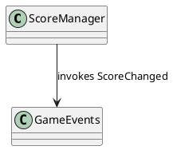

# Diagrams

Automated generation of architecture diagrams and debugging reports for the Zombtoy project.

## Contents

**Core Visualization Scripts (Python 3.9+):**
- `generate_event_flow.py` – Scans `Assets/Scripts` for GameEvents declarations, producers (invocations), and consumers (subscriptions) to build an event flow graph.
- `generate_class_dependency.py` – Extracts classes, inheritance, and interface implementations to produce a class dependency (inheritance / implementation) UML diagram.
- `generate_call_graph.py` – Performs a lightweight static scan to approximate inter-class method call relationships (high-level call graph, not per-method detail accuracy guaranteed).

**New Core Architecture & Debugging Tools:**
- `generate_gameevents_debug.py` – **NEW!** Comprehensive GameEvents analysis including:
  - Event usage patterns and health check
  - Subscription/unsubscription mismatches (memory leak detection)
  - Dead events (no subscribers) and unused events (never fired)
  - Lifecycle method compliance checking
  - Detailed debugging report (Markdown) + health visualization (PlantUML)
- `generate_core_architecture.py` – **NEW!** Core architecture visualization showing:
  - Core components vs Managers categorization
  - Singleton patterns and dependency relationships
  - Lifecycle flow sequence diagrams
  - Architectural patterns analysis

**Orchestration:**
- `generate_all.py` – Runs all generators and renders diagrams automatically.

**Generated Output:**
- `out/*.puml` – PlantUML sources
- `out/*.png` or `out/*.svg` – Rendered diagrams (if PlantUML + Graphviz available)
- `out/*_report.md` – Detailed analysis reports (Markdown format)

## Status

✅ **Fully Tested and Enhanced** (Latest Update: Core Architecture Analysis)
- All scripts execute successfully with enhanced error handling
- Generated `.puml`, `.png`, `.svg`, and `.md` outputs
- **GameEvents Debug Report**: Shows 19 potential issues including subscription mismatches
- **Core Architecture**: Visualizes 5 Core components + 9 Managers with dependency relationships
- Event flow diagram shows 16+ events with comprehensive publisher/subscriber mapping
- Class dependency diagram shows inheritance chains (MonoBehaviour, Singleton<T>, etc.)

## Quick Start

### Prerequisites

1. **Python Environment**: Use the configured Python virtual environment in the project root.
2. **Install PlantUML + Graphviz** (for automatic rendering):
```bash
# Install via Homebrew (macOS)  
brew install plantuml graphviz

# Or via package manager (Linux)
sudo apt-get install plantuml graphviz  # Ubuntu/Debian
```

### Generate All Diagrams

```bash
# From project root
cd DevTools/Diagrams
python3 generate_all.py

# This runs all generators and produces:
# - 6+ PlantUML diagrams (.puml)
# - Rendered images (.png, .svg) 
# - 2 detailed analysis reports (.md)
```

### Individual Generators

```bash  
# GameEvents debugging & health analysis
python3 generate_gameevents_debug.py

# Core architecture visualization  
python3 generate_core_architecture.py

# Classic event flow diagram
python3 generate_event_flow.py

# Class inheritance analysis
python3 generate_class_dependency.py

# Method call relationships
python3 generate_call_graph.py
```

## Outputs Explained

### GameEvents Analysis (`generate_gameevents_debug.py`)
- **`gameevents_debug_report.md`**: Comprehensive analysis including:
  - Issues detected (memory leaks, dead events, lifecycle problems)
  - Event overview with publishers/subscribers count
  - Class event interactions and lifecycle method compliance
- **`gameevents_health.puml`**: Color-coded health visualization:
  - 🟢 Green: Healthy events (has publishers & subscribers)
  - 🔴 Red: Dead events (no subscribers)
  - 🟠 Orange: Unused events (never fired)
  - 🔵 Blue: Potential bottlenecks (1 subscriber, many publishers)

### Core Architecture (`generate_core_architecture.py`)  
- **`core_architecture.puml`**: Package diagram showing Core vs Managers
- **`core_lifecycle_flow.puml`**: Sequence diagram of typical initialization flow
- **`core_architecture_report.md`**: Detailed component analysis including:
  - Singleton patterns usage
  - Dependency injection analysis
  - Lifecycle method patterns
  - GameEvents integration points

### Legacy Diagrams (Enhanced)
- **`event_flow.puml`**: Publisher → Event → Subscriber relationships
- **`class_dependency.puml`**: Inheritance and interface implementation chains  
- **`call_graph.puml`**: High-level inter-class method calls

## Key Features

### 🔍 **GameEvents Debugging**
- Detects subscription without unsubscription (memory leak risk)
- Identifies dead events and unused event triggers
- Validates lifecycle method patterns (OnEnable/OnDisable pairs)
- Reports events with no publishers or no subscribers

### 🏗️ **Core Architecture Analysis**
- Categorizes components by architectural role (Core vs Managers)
- Maps singleton patterns and dependency relationships
- Shows integration with GameEvents bus
- Validates lifecycle method usage patterns

### 🎨 **Enhanced Visualizations** 
- Color-coded health indicators
- Comprehensive legends and annotations
- Multiple output formats (PNG, SVG, PDF via PlantUML)
- Markdown reports for detailed analysis

## Testing

```bash
# Run comprehensive tests
python3 run_tests.py

# Individual test
python3 test_diagrams.py
```

## Integration with GameEvents Debugging

The new tools complement the enhanced `GameEvents.cs` which now includes:
- Debug logging for event firing with subscriber counts
- Safe-invoke helpers to prevent exceptions from breaking event chains
- Subscriber count utilities for runtime debugging

Example debug output from enhanced GameEvents:
```
[GameEvents] EnemyKilled fired, subscribers=1, score=100
[GameEvents] EnemySpawned fired, subscribers=1, enemy=Zombunny(Clone)
```

## Requirements

- **Python 3.9+**
- **PlantUML** (optional, for rendering)  
- **Graphviz** (optional, for layout)
- Access to `Assets/Scripts` directory

## Troubleshooting

- **No diagrams rendered**: Install PlantUML and Graphviz
- **Empty outputs**: Check that `Assets/Scripts` path is correct
- **Permission errors**: Ensure write access to `DevTools/Diagrams/out/`

For issues, check the console output when running generators.

Run the automated test suite to verify diagram generation (from `DevTools/Diagrams/`):

```bash
# Run comprehensive test suite (unit + functional tests)
python3 run_tests.py

# Or run just unit tests
python3 test_diagrams.py
```

**Test Coverage:**
- ✅ Code stripping (comments, string literals)
- ✅ Event detection (declarations, producers, consumers)
- ✅ Class relationship parsing (inheritance, interfaces)
- ✅ Generic base class handling (PlantUML compatibility)
- ✅ Call graph generation
- ✅ PlantUML output format validation
- ✅ End-to-end workflow testing

## Rendering Without Local PlantUML
If PlantUML is not installed, you can paste the contents of any `.puml` file into https://www.plantuml.com/plantuml.

## Script Heuristics & Notes
These scripts use regex-based static parsing (fast, zero external dependencies) and make best-effort inferences:
- They ignore commented-out code and string literals (basic stripping) but may still produce false positives in edge cases.
- Method call graph is class-to-class (aggregated), not per-method detailed—suitable for high-level architecture understanding.
- Event producer detection looks for patterns like `GameEvents.<EventName>?(`, `.Invoke(`, or helper `Raise<EventName>` methods.
- Consumer detection looks for `+=` subscriptions to `GameEvents.` events.

For higher fidelity (future enhancement): integrate Roslyn via a small .NET global tool or use the official C# language server for precise AST analysis.

## Output Files
- `event_flow.puml` – Event publishers -> event nodes -> subscribers.
- `class_dependency.puml` – Inheritance and interface implementation (extends / implements relationships).
- `call_graph.puml` – High-level class interaction (calls) graph.

## Example PlantUML Snippet


## Regeneration
Re-run `python3 generate_all.py` (from `DevTools/Diagrams/`) after code changes.

> **⚠️ Staleness note:** everything in `out/` is a snapshot of the codebase at generation time — the
> committed artifacts date from **Oct 14 2025** and predate the Titan Zombunny / rocket work. Treat
> `out/*_report.md` as evidence only after regenerating. (Old docs referenced a
> `~/Desktop/Zombtoy-Project/.venv` interpreter from a previous copy of this repo; plain `python3 3.9+`
> works — the scripts have no external dependencies.)

## Future Ideas
- Per-method call subgraphs.
- Scene/Prefab usage overlay.
- Asset-to-script dependency map.
- Network message flow (post multiplayer integration).

---
Generated scripts are safe to modify; keep heuristics simple and fast.
