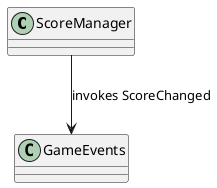

# Diagrams

Automated generation of architecture diagrams (PlantUML format) for the Zombtoy project.

## Contents

Scripts (Python 3.9+):
- `generate_event_flow.py` – Scans `Assets/Scripts` for GameEvents declarations, producers (invocations), and consumers (subscriptions) to build an event flow graph.
- `generate_class_dependency.py` – Extracts classes, inheritance, and interface implementations to produce a class dependency (inheritance / implementation) UML diagram.
- `generate_call_graph.py` – Performs a lightweight static scan to approximate inter-class method call relationships (high-level call graph, not per-method detail accuracy guaranteed).
- `generate_all.py` – Orchestrates all generators. Run this for a full refresh.

Generated output:
- `out/*.puml` – PlantUML sources.
- `out/*.png` or `out/*.svg` – Rendered diagrams (if PlantUML + Graphviz available).

## Quick Start

1. Ensure Python 3.9+ is installed.
2. (Optional) Install PlantUML + Graphviz for automatic rendering.

```bash
# (fish shell) create a venv (optional)
python3 -m venv .diagram-venv
source .diagram-venv/bin/activate
pip install plantuml graphviz
```

3. Run all generators:
```bash
python Diagrams/generate_all.py
```

4. View diagrams in `Diagrams/out`.

## Rendering Without Local PlantUML
If PlantUML is not installed, you can paste the contents of any `.puml` file into https://www.plantuml.com/plantuml.

## Script Heuristics & Notes
These scripts use regex-based static parsing (fast, zero external dependencies) and make best-effort inferences:
- They ignore commented-out code and string literals (basic stripping) but may still produce false positives in edge cases.
- Method call graph is class-to-class (aggregated), not per-method detailed—suitable for high-level architecture understanding.
- Event producer detection looks for patterns like `GameEvents.<EventName>?(`, `.Invoke(`, or helper `Raise<EventName>` methods.
- Consumer detection looks for `+=` subscriptions to `GameEvents.` events.

For higher fidelity (future enhancement): integrate Roslyn via a small .NET global tool or use the official C# language server for precise AST analysis.

## Output Files
- `event_flow.puml` – Event publishers -> event nodes -> subscribers.
- `class_dependency.puml` – Inheritance and interface implementation (extends / implements relationships).
- `call_graph.puml` – High-level class interaction (calls) graph.

## Example PlantUML Snippet


## Regeneration
Re-run `python Diagrams/generate_all.py` after code changes.

## Future Ideas
- Per-method call subgraphs.
- Scene/Prefab usage overlay.
- Asset-to-script dependency map.
- Network message flow (post multiplayer integration).

---
Generated scripts are safe to modify; keep heuristics simple and fast.
