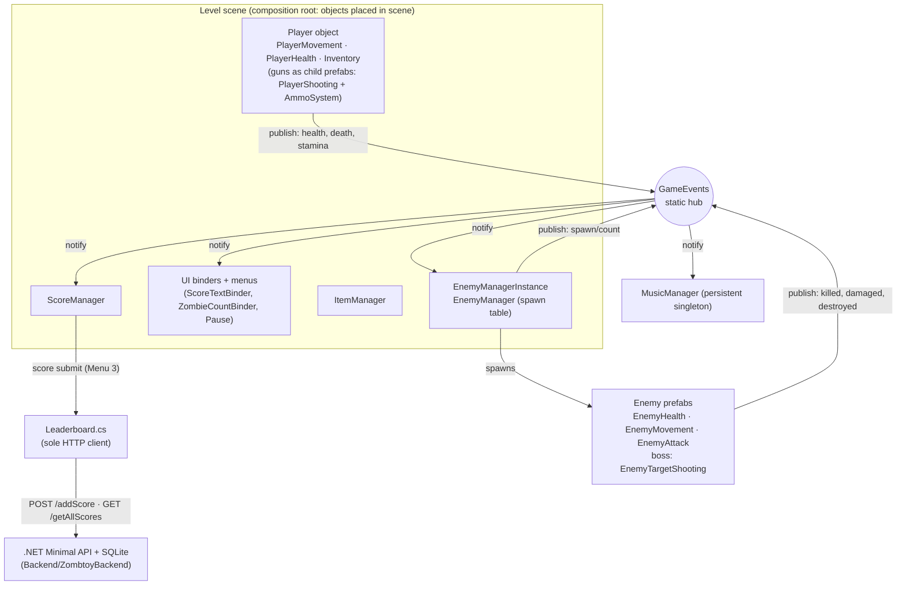

# Zombtoy Principal-Engineer Plan

**Date:** 2026-07-12 · **Branch:** `feature/Titan-Zombunny` @ `441cae5b` (clean tree) · **Author:** principal-engineer review session (Claude Fable 5, read-only)

This is a decision document. It re-evaluates the entire architecture from first principles, treats every prior plan and audit as a hypothesis, and records what was independently re-verified. It supersedes the *architectural* content of `docs/reexploration/NEXT_MILESTONES.md` where the two conflict (specifically M3); the milestone mechanics of M1/M2 remain valid as written.

## 0. Evidence base — what this session verified independently

The 2026-07-12 audit corpus (`docs/reexploration/*`, `docs/CODE_MAP.md`) was used as an index, then its load-bearing claims were re-derived from primary sources this session:

| Claim | Method | Result |
|---|---|---|
| Dormant layer has zero scene/prefab wiring | Re-traced GUIDs of all 7 alleged-dormant scripts (`WeaponManager`, `WeaponSystem`, `GameStateManager`, `PlayerHealthRefactored`, `PlayerInputManager`, `GameStarter`, `GameOverManager`) across every `.unity`/`.prefab` | **0 references each — confirmed** |
| Multiplayer speculation drove the dormant layer | grep for network/multiplayer in `Weapons/`, `Core/`, `PlayerInputManager` | Confirmed: `synchronizeAcrossNetwork = true` defaults, `WeaponState` "for networking", `OnNetworkEvent` (0 users), "ready for multiplayer" headers throughout |
| Live code carries dead-system shims | grep `PlayerHealthProxy` / `Type.GetType` | 3 live files (`HealthPotion`, `AmmoItem`, `EnemyManager:141`) carry reflection probes for a class that is never attached |
| GameStateManager wiring was already tried and reverted | Read `ScoreManager.cs:168-186` | **"Temporarily disable game state checking to restore functionality — TODO: Re-enable once GameStateManager integration is properly tested"** — the integration regressed live scoring and was backed out. Remaining usage is log-only |
| `ComponentCache` is dormant-only | reference grep | Referenced only by the 4 dormant scripts — deletable with them |
| No `WeaponData` assets exist | grep `*.asset` + `CreateAssetMenu` census | Zero SO instances; deleting `WeaponSystem.cs` orphans nothing serialized |
| `PlayerMovementRefactored` attached-but-disabled | GUID grep | Level1 only (1 hit, `m_Enabled: 0`); plus one code ref from dormant `PlayerHealthRefactored` |
| Both leaderboard clients wired in `Menu 3.unity` | GUID grep | Confirmed: `HighScores` (dreamlo) and `Leaderboard` (.NET) both present |
| `GameObject.Find` count | grep today vs baseline tree | 54 calls in `Assets/Scripts` today; baseline (`071291f5`) had 45 scripts total, today 72 |
| Live GameEvents traffic | publisher/subscriber grep | Live publishers: `PlayerHealth`, `EnemyHealth`, `ScoreManager`, `EnemyManager`, `SpawnClown`, `TransientEnemyRegistration`. Live subscribers: `ScoreManager`, `EnemyManager`, `MusicManager`, `ScoreTextBinder`, `ZombieCountBinder`. (Dormant scripts also pub/sub but never run) |
| Backend = 3 endpoints, string scores | read `Program.cs` | Confirmed; matches its README exactly. **No Dockerfile exists anywhere** — "Docker infrastructure" exists only in the aspirational integration guide |
| Repo state | git/gh | PRs #28 (Titan) and #25 (inventory) OPEN; M1 fix committed & pushed (`b993e60a`); `Rocket.cs` UnityEditor breaker gone; 3 stashes; Level2 not in build (7 scenes are) |

Everything below rests on these verifications, not on documentation claims.

---

## 1. Executive Verdict

**The current architecture is a healthy, small, Unity-native live core wearing a ~2,300-line dead exoskeleton.** The live game — legacy player/weapon/enemy components, the static `GameEvents` hub, four scene-placed singleton managers, event-driven UI binders, one HTTP client against a 3-endpoint .NET API — is coherent, traceable, and appropriately sized. In parallel sits a compiled-but-never-wired replacement framework (weapons, health, input, game-state) written in Aug 2025 for a multiplayer future that has no concrete requirements, plus repo hygiene debt (a "deleted" Node backend still tracked with `node_modules`, tracked C build artifacts, two leaderboard clients wired simultaneously).

- **Restart: No.** The live core works and is understandable; the problems are subtraction problems, which are the cheapest kind. A restart discards the verified-good parts (managers, event hub, boss content, backend) to escape code that can simply be deleted.
- **Existing modernization direction: sound in sequence, wrong in one destination.** The dependency order (finish Titan → land inventory → then decide the dormant layer → hygiene → tooling) survives adversarial review. What does not survive is M3's "likely wire in" verdict for the game-state trio — see §4. This plan redefines M3 as **The Cull**: deletion, not completion.
- **The central architectural mistake to avoid:** building a parallel replacement next to a live system and calling it progress. It has happened once (the Aug 2025 layer), it stalled a working game for months of refactor work, and its residue — reflection probes, `*Refactored` filenames that lie, a disabled state-manager integration — is the single largest source of confusion in the repo. The countermeasure is a standing rule, not a one-time fix: **code that isn't wired into a scene, prefab, or live code path in the same PR does not merge.**
- **Strategic direction:** finish the two open PRs, execute one deletion PR, adopt the governance rules in §9, then spend the next years on gameplay — with architecture evolving in place, at named triggers, in the style `Inventory.cs` already proved works.

## 2. Product and Architecture Identity

**Zombtoy is two things on purpose, and nothing else:**

1. **A focused solo Unity game** — a Survival-Shooter-derived wave shooter with 4 weapons, a handful of enemy types, a boss in progress, and score chasing. That is the product.
2. **A deliberate backend learning sandbox** — the .NET minimal API is real and live; the C backend is an explicitly educational re-implementation; the 1,311-line integration guide is a study document. This is a legitimate, owner-chosen identity (the README says "will likely keep using .NET minimal for the context of this project"), and it stays healthy exactly as long as it hides behind a tiny stable HTTP contract.

It is **not** a reusable framework, not a platform, not a live-service prototype. No paying users, no team, no scale pressure. Every "framework-grade" artifact in the repo (network-ready weapon state, input abstraction "for multiplayer", `OnNetworkEvent`) is speculation that redefined the product upward, and all of it went unused.

**The binding constraint nobody previously designed for: burst development.** The commit history shows bursts (Aug refactor, Sep inventory, Oct camera, Nov boss) separated by months of silence, ~40 commits/year. The architecture's chief enemy is not scale — it is **disorientation**: the Nov 2025 stall happened mid-task, and the repo then sat for 8 months partly because nothing recorded what was real. Therefore the architecture standard for Zombtoy is:

> **Boring, wired, observable.** One live path per concern. No dormant code. Docs that match runtime truth (CODE_MAP discipline). Any returning developer — human or AI — must be able to re-orient in under an hour.

This standard is what "supports five years of development" actually means for this project.

## 3. Current Architecture Assessment

### 3.1 Healthy live core (verified wiring)

| Layer | What actually runs |
|---|---|
| Player | `PlayerMovement` (WASD + mouse-ray turn), `PlayerHealth` (health+stamina+sprint), `PlayerShooting` (on gun prefabs), `Inventory` (data-driven weapon switching) |
| Weapons | Per-weapon scripts (`Pistol`, `RocketLauncher`, `TornadoLaunch`, `IceBullet`) + projectiles (`Rocket`, `Tornado`) + `Ammo`/`reloadCheck` ×9 instances; `IBlast` is the one live interface |
| Enemies | `EnemyHealth`/`EnemyMovement`/`EnemyAttack` on prefabs; `EnemyManager` weighted spawn table (the **only** spawner in Level1); boss = `EnemyTargetShooting` + `EnemyRocket Variant` (fixed 2026-07-12) |
| Cross-cutting | `GameEvents` static hub; `Singleton<T>` (no auto-create — good); scene-placed `ScoreManager`/`EnemyManager`/`ItemManager`/`MusicManager` |
| UI | Event-driven binders (`ScoreTextBinder`, `ZombieCountBinder`) + legacy menu/pause/results scripts |
| Backend | `Leaderboard.cs` (HttpClient) → .NET 8 Minimal API + SQLite, 3 endpoints |

### 3.2 What the 2025–2026 journey got right (baseline `071291f5` → today)

- Managers rewritten from near-empty stubs into real, wired systems (ScoreManager 35→352 l, EnemyManager 41→622 l).
- `GameEvents` — the single highest-leverage addition; legacy and new code both publish through it, so the event architecture is real.
- `Inventory.cs` — refactored **in place**, data-driven with legacy fallback, zero parallel version. **This is the house pattern.** PR #25's `AmmoSystem` follows it (a reusable component, not a manager).
- Backend Node→.NET executed completely, kept minimal, documented accurately.
- The 2026-07-12 audit pass itself: docs now distinguish "exists" from "runs", and the M1 boss fix encoded its lesson as a runtime guard.

### 3.3 What went wrong

- **The parallel layer (~2,300 lines, 10 scripts):** compiled, never wired, multiplayer-motivated. Worse than dead weight — it leaks into live code as reflection probes (3 files), fallback branches, and a reverted `ScoreManager` integration, and its filenames (`PlayerHealthRefactored`) actively mislead.
- **The refactor's own #1 goal regressed:** "remove all `GameObject.Find`" was checked off while occurrences grew 43→65 (54 in `Assets/Scripts` today); the refactor's centerpiece itself calls `Find`.
- **Hygiene debt:** tracked `node_modules` (source of the 4 dependabot alerts), tracked C build artifacts (`mongoose.o`, `obj/`, binary, `.db`), two leaderboard clients live simultaneously, `Level2.unity` orphaned from the build, 3 aging stashes, an integrated-but-standing refactor branch.
- **Documentation used to overstate completion** — corrected by the audit pass; keeping it truthful is now a process rule (§9).

### 3.4 Adversarial review of prior recommendations

| Prior claim/recommendation | Verdict | Evidence |
|---|---|---|
| REFACTOR_PLAN: "✅ REFACTOR COMPLETED" | **Falsified** (already by audits; re-confirmed) | 7 dormant scripts, 0 refs; live game runs legacy stack |
| Issue #3: "New weapon system tied with WeaponManager" | **Rejected — close the issue** | WeaponManager 0 refs, no WeaponData assets ever created, superseded by the live `Inventory` + PR #25 `AmmoSystem` path |
| NEXT_MILESTONES M1→M2 ordering (Titan first, then inventory) | **Upheld** | `EnemyProjectile.cs` conflict surface is real; #25 must rebase onto the Titan version |
| NEXT_MILESTONES M3: "likely wire in GameStateManager/GameStarter/GameOverManager — cheap, immediate value" | **Falsified → revised to delete** | Wiring was already attempted and **reverted after it broke scoring** (`ScoreManager.cs:170` TODO). The trio encodes 2025 multiplayer assumptions, needs per-scene UI wiring to function, and game-over currently works via legacy paths. Rebuild small when a game-flow feature actually starts (§10) |
| NEXT_MILESTONES M3: "pick ONE weapon architecture, delete the loser" | **Upheld — and decided now** | Live path wins. Evidence: dormant framework has 0 refs + no data assets + network speculation; live path is wired, play-tested, and has a successor already reviewed in PR #25 |
| BASELINE_COMPARISON: "grade B, no restart" | **Upheld** | Independent re-measurement matches (§0) |
| "GameEvents = highest-leverage addition" | **Upheld with caveats** | True; but trigger methods bypass the existing `SafeInvoke` (one throwing subscriber can starve later ones), `OnNetworkEvent` has zero users, and hot-path events (`EnemySpawned`/`Destroyed`/`Killed`) allocate log strings every invocation |
| CODE_MAP per-file statuses | **Verified by sampling** | 7/7 dormancy GUID checks and the pub/sub census matched exactly |
| DOTNET guide as target design | **Keep as reference only** | No Docker, no SignalR, no auth exists; backend stays minimal until §10 triggers fire |

## 4. Keep / Evolve / Replace / Delete / Defer

**Timing keys:** *now* = in the next milestones (§8) · *at-need* = when the named trigger fires · *owner* = needs a one-line owner decision first.

### Core / cross-cutting

| System | Status (evidence) | Decision | Reason / risk | Timing |
|---|---|---|---|---|
| `GameEvents` | Live hub, 19 events + `OnNetworkEvent` (0 users) | **Keep + trim** | Right-sized decoupling for score/health/enemy-count fan-out. Trim: delete `OnNetworkEvent`; route triggers through the existing `SafeInvoke`; gate per-event `Debug.Log` behind `#if UNITY_EDITOR \|\| DEVELOPMENT_BUILD`. Risk: none (removals are unused paths) | Cull (delete event) + at-need (hardening) |
| `Singleton<T>` | Live base of 4 managers; **no auto-create by design** | **Keep as-is** | The no-auto-create choice is load-bearing: it makes scene placement the composition root and keeps dormant code dormant. Do not "fix" it | — |
| `ScoreManager`, `EnemyManager`, `ItemManager`, `MusicManager` | Scene-placed, live | **Keep; evolve in place** | Real global ownership. Evolve: strip ScoreManager's dead GameStateManager log-block; drop EnemyManager's proxy probe (Cull); spawn tables → ScriptableObject only at trigger (§6) | now (strips) / at-need |
| `GameStateManager` + `GameStarter` + `GameOverManager` | Dormant trio, 0 scene refs; integration previously reverted | **Delete; rebuild small at-need** | There is no live state machine to evolve — pause/death/restart run through legacy paths that work. The trio is unproven, interdependent, multiplayer-flavored, and needs per-scene wiring to do anything. When issue #19 (single-scene game flow) starts, write a minimal `GameFlow` **wired the same day**. Git preserves the old code if wanted. Risk: rewriting later costs a few hours; keeping costs permanent confusion | Cull |
| `ComponentCache` | Referenced only by the 4 dormant scripts | **Delete** | Orphaned by the other deletions. Capability lost: none in any live path | Cull |

### Player

| System | Status | Decision | Reason / risk | Timing |
|---|---|---|---|---|
| `PlayerMovement` | Live movement/turn owner | **Keep** | 60 lines, works, the M1 fix documented its floor-raycast contract | — |
| `PlayerHealth` | Live god-object (health+stamina+sprint+UI pokes+`LoadScene(2)`) | **Evolve in place** (Inventory-style) | Split only when a feature touches it: extract `PlayerStamina` component; move UI writes to a binder; replace hardcoded scene index with scene name. Never a parallel rewrite. Risk of leaving as-is: low — it works | at-need |
| `PlayerShooting`, `Inventory` | Live | **Keep** (Inventory = house-pattern exemplar) | — | — |
| `PlayerHealthRefactored` (491 l) + `PlayerHealthProxy` | Dormant; reached only by reflection probes | **Delete + strip the 3 probes** | Deleting *simplifies live code* (HealthPotion, AmmoItem, EnemyManager lose dead branches). Capability lost: a component-split health design — re-derivable at need | Cull |
| `PlayerMovementRefactored` | Attached-**disabled** on Level1 Player | **Delete file + remove the disabled component** (one scene edit) | Never enabled; re-enabling would fight `PlayerMovement` for the transform | Cull |
| `PlayerInputManager` | Dormant, 0 refs, "multiplayer-ready" | **Delete** | Input polling in 3–4 scripts with `Keybinds` statics is adequate at this scale. Trigger to rebuild: rebinding UI or gamepad support | Cull |

### Weapons

| System | Status | Decision | Reason / risk | Timing |
|---|---|---|---|---|
| Per-weapon scripts + projectiles | Live | **Keep concrete** | 4 weapons don't justify a framework. Abstraction trigger: §9 rule-of-three | — |
| `Ammo` ×9 + `reloadCheck` ×9 | Live, duplicated | **Replace incrementally with `AmmoSystem`** (PR #25) | The component (not manager) design is right; it's the Inventory pattern applied to ammo. Risk: serialized-field re-wiring across 9 instances — play-test each weapon | M2 |
| `WeaponSystem` (IWeapon/WeaponData/BaseWeapon), `WeaponManager`, `RaycastWeapon`, `ProjectileWeapon` | Dormant, 0 refs, no assets | **Delete** | The only good idea in it (SO-based weapon config) is re-creatable in an afternoon at the §6 trigger, without the network baggage. Do not complete it because effort was spent on it | Cull (after #25 lands — it touches `ProjectileWeapon`/`IFirearm`) |
| `IBlast` | Live (Rocket, SelfDestruct → EnemyHealth) | **Keep** | Earned interface: 2 implementors + 1 consumer, real polymorphism | — |
| `IFirearm`, `ISpell`, `IPlayerWeapon` (+ `IProjectile` on #25) | Dormant contracts | **Delete unless #25 lands live implementors** | Judge after M2: any interface with a wired implementor stays; the rest go | Cull |

### Enemies / boss

| System | Status | Decision | Reason | Timing |
|---|---|---|---|---|
| Enemy prefab stack + support scripts | Live | **Keep** | Works; NavMesh chase is fine for current counts (≤50 cap) | — |
| `EnemyTargetShooting` (Titan) | Fixed, pending play-test | **Keep; finish M1 validation** | Boss architecture question (spawn-table vs scene-placed) is an owner call — recommend scene-placed for a scripted boss, spawn-table only if bosses become a recurring wave type | now (owner) |
| Double-speed quirk (`Rocket`, `EnemyProjectile` apply `speed` twice in `FixedUpdate`) | Live oddity | **Defer fix to first balancing pass** | Behavior-preserving discipline: current tuning depends on the quadratic value | at-need |

### UI / scenes / score

| System | Status | Decision | Reason | Timing |
|---|---|---|---|---|
| Binder pattern (`ScoreTextBinder`, `ZombieCountBinder`) | Live | **Keep; make it the standard** for new UI | Correct boundary: UI subscribes, gameplay publishes | — |
| Legacy menu/pause/result scripts | Live | **Keep; evolve opportunistically** | Consolidate during #19 work, not before | at-need |
| `vectorTest.cs` | Scratch, live in Level1 | **Delete + scene edit** | Debug leftover | Cull |
| `Assets/Prefabs/Player.prefab` | 0 scene refs (stale snapshot) | **Delete after final GUID re-check** | Level1's Player is a scene object, not an instance of it | Cull |
| `Level2.unity` | Not in build; wires managers | **Owner decision; default delete** | Orphaned content contradicts the single-scene direction (#19) | M4 (owner) |
| `HighScores.cs` (dreamlo) | Wired in Menu 3 alongside `Leaderboard.cs` | **Delete client + scene ref; .NET is canonical** | Owner already declared .NET the path; two live clients = confusion + a third-party dependency. Capability lost: leaderboard-without-local-server — acceptable for a dev project; revisit if the game ships publicly | M4 (owner confirm) |
| `Debug/ScoreDebugger`, `ScoreManagerDebugger` | Diagnostic | **Keep if wired for debugging; else delete at Cull time** (GUID-check then) | Cheap either way | Cull |

### Backend / tooling / repo

| System | Status | Decision | Reason | Timing |
|---|---|---|---|---|
| `Backend/ZombtoyBackend` (.NET) | Live, minimal, accurate README | **Keep as-is** | Right-sized. Next evolution only at §10 trigger (named scores) | — |
| `Backend/ZombtoyBackend-C` | Educational, quarantined by owner | **Keep sources; untrack build artifacts** (`mongoose.o`, `obj/`, binary, `zombtoy_c.db`) + gitignore | Learning artifact is a legitimate identity (§2); binaries in git are not | M4 |
| `Assets/Scripts/Server/zombtoy-backend` (Node + `node_modules`) | Obsolete, still tracked, dependabot source | **Delete** | Declared removed in `d40b4eb2`; nothing references it (`Leaderboard.cs` targets .NET) | M4 |
| `DevTools/Diagrams` | Runnable; `out/` stale (Oct 2025); `EVENT_RAISE_RE` undercounts trigger-style raises | **Keep; fix regex; regenerate after Cull** | Useful re-orientation tooling; regenerating *after* deletion makes diagrams match reality | M5 |
| Shell scripts | Utility | **Keep** | — | — |
| Branches/stashes | `core-architecture-refactor` fully integrated; 3 stashes; 2 historical remotes | **Archive/delete branch; apply-or-drop stashes during M2; delete historical remotes** | Reduce the "what work exists where" question to zero | M2/M4 |
| GitHub issues | #3 obsolete; #16 wording assumes "migration" | **Close #3 with a pointer here; re-scope #16 to "cull complete"; keep feature issues** | Issues should reflect the decided direction | M4 |

## 5. Target Architecture

The target is the **live architecture, completed and cleaned** — not a new one.

**Dependency direction (enforced by review, not tooling):**
- Gameplay components may call **managers' public APIs** and **publish to GameEvents**.
- Managers may subscribe to GameEvents and own their domain state. Managers never reach into UI objects (UI failures must never break gameplay).
- UI depends on **GameEvents + its own serialized scene refs** only.
- Only `Leaderboard.cs` speaks HTTP. Nothing in the backend knows Unity exists.
- Tooling (`DevTools/`) reads game code; game code never references tooling.

**Runtime composition & scene lifecycle:**
- The scene **is** the composition root. Managers exist because they are placed (Singleton no-auto-create stays). Persistent-singleton whitelist: `ScoreManager`, `MusicManager` (anything else persisting is a bug).
- Rule from the Titan lesson, generalized: **prefabs must be self-sufficient** — no required serialized field left `{fileID: 0}` to be filled by scene overrides; runtime guards refuse invalid bindings loudly (as `EnemyTargetShooting` now does).
- Scene transitions by **name**, not build index (retire `LoadScene(2)` when next touching `PlayerHealth`).
- Subscription hygiene: subscribe in `OnEnable`, unsubscribe in `OnDisable`, symmetric — static events + scene reloads make asymmetry a leak.

**Data & configuration ownership:** inspector-serialized values on components/prefabs (status quo) until the §6 ScriptableObject triggers fire. Persistence = `PlayerPrefs` for high score (status quo) until a progression feature demands a save file.

**Backend boundary (stable contract):** `GET /` health, `POST /addScore` (text or `{"score": "…"}`), `GET /getAllScores` (comma-joined text). Evolution: v2 = named scores (`{name, score, timestamp}`, JSON array response) **when a leaderboard-UI feature wants names** — implemented as new endpoints alongside the old until the client migrates. Auth/multiplayer: §12.

**Testing boundary:** when logic is pure (spawn-weight selection, score math, ammo arithmetic), extract it into plain-C# methods and cover with EditMode tests — *when first touched for a feature*. No play-mode harness until manual play-tests demonstrably fail to catch a class of bug twice (#13 stays deferred).

## 6. Architectural Pattern Decisions

| Pattern | Verdict | Ruling |
|---|---|---|
| **Direct serialized references** | **Recommended now (default)** | For everything intra-scene/intra-prefab. `[SerializeField]` over `Find`; any file you touch loses its `GameObject.Find` calls (opportunistic burn-down of the 54 — no big-bang: that was tried and regressed) |
| **Static event bus (`GameEvents`)** | **Recommended now, scoped** | For gameplay **state-change notifications** with 1→N fan-out (health, score, death, enemy counts, game phase). Not for request/response, not per-frame data, not UI→gameplay commands (call methods directly). Keep it one flat static class — it's traceable precisely because it's dumb |
| **Typed message bus / command system** | **Reject** | Indirection without a demonstrated need; GameEvents already covers fan-out. Reconsider only if event count triples with real subscribers |
| **Dependency injection (containers)** | **Reject** | Scene placement + serialized refs + `Singleton<T>.Instance` **is** the injection story at this scale. No composition-root framework, no service locator beyond the existing singletons |
| **Singletons** | **Recommended selectively** | Exactly the 4 that represent genuinely global, long-lived ownership. Bar for a new one: state that must outlive or span scenes AND has multiple unrelated consumers. Everything else is a component |
| **MonoBehaviour composition** | **Recommended now (default)** | `AmmoSystem`-style reusable components over base-class hierarchies. `BaseWeapon`-style inheritance: rejected (it died unwired once already) |
| **ScriptableObjects** | **Defer, with triggers** | Adopt for **config data only** when: (a) the same tuning values get edited across 3+ prefabs/scenes, or (b) a balancing pass starts (weapon stats, enemy spawn tables are the natural first two). Reject SO-based event channels and SO runtime state — hidden global state, worse traceability than the static hub |
| **ECS / DoTS** | **Reject** | `maxTotalEnemies = 50`. No profiler evidence of entity-count pressure. Revisit only with a profiled bottleneck a pool can't fix |
| **State machines** | **Recommended selectively** | (a) Inside the boss script when the Titan grows phases — a plain enum + switch, local to the script. (b) A minimal `GameFlow` (Playing/Paused/GameOver) **when issue #19 starts**, scene-placed, wired same-PR. No FSM framework, no library |
| **Inheritance vs composition** | **Composition** | Keep `Singleton<T>` and small earned interfaces (`IBlast`). No new abstract gameplay base classes |
| **Service boundaries** | **Backend only** | One HTTP client class, one API. No service layer inside Unity |
| **Feature/domain folders** | **Defer** | Current folders are fine; moving files churns GUID-history for zero runtime gain. New features may create their own folder (e.g. `Scripts/Boss/`). Never a standalone reorganization PR |

## 7. Coupling Analysis (ranked by practical risk)

1. **Parallel-architecture coupling (worst, fixable now):** live files probing dead classes via reflection; `ScoreManager` carrying a reverted integration; filenames lying about what runs. This already caused one shipped regression-and-revert and the multi-month disorientation. **Removed wholesale by the Cull.**
2. **String coupling — `GameObject.Find` (54) + `SendMessage` + `Type.GetType`:** silent breakage on rename; several sit in `Awake`/spawn paths. Policy: opportunistic removal in every touched file; the probes/SendMessage go with the Cull.
3. **Scene-serialization drift:** manager fields and 9 ammo instances hand-wired per scene ×3 level scenes; Level2 already drifted out of the build. Mitigation: prefab self-sufficiency rule now; real fix arrives with single-scene consolidation (#19).
4. **Global-state coupling (accepted, bounded):** 4 singletons + static events. Acceptable because ownership is genuinely global and the no-auto-create rule keeps composition explicit. Enforce the OnEnable/OnDisable symmetry rule; keep an eye on `MusicManager`+`ScoreManager` persistence across scene loads (duplicate-instance warnings in `Singleton.Awake` are the tripwire).
5. **Temporal coupling:** `Instance` access during `Awake` ordering races — mitigated by `FindObjectOfType` fallback; rule: managers self-initialize in `Awake`, consumers touch them from `Start`/`OnEnable` onward.
6. **Gameplay→UI pokes:** `PlayerHealth` writes sliders/images directly and `Find`s UI objects; `Death()` grabs `Find("Fill")`. Contained; migrate to binder pattern when `PlayerHealth` is next touched.
7. **Hardcoded scene index** (`LoadScene(2)`): breaks silently when the build list changes. Fix with names at next touch.
8. **Backend coupling:** minimal and stable; scores stored as strings is a wart to fix inside the v2 contract, not before.
9. **Docs/process coupling:** now the strongest part of the repo — keep it that way via §9 rules (docs updated in the same PR that changes status).

## 8. Migration Strategy

Small vertical steps, each independently shippable, each with a rollback point. M1/M2 are inherited from `NEXT_MILESTONES.md` unchanged; M3 is redefined by this plan.

### M1 (tail) — Validate & merge PR #28  *(in flight)*
- **Objective:** close out the Titan branch. **Prereqs:** none.
- **Scope:** owner play-test (walk in/out of boss range while moving the mouse — rotation never freezes; crosshair tracks; rockets fire; zero NREs), then merge #28 (fast-forwardable).
- **Must not change:** anything else. **Rollback:** branch survives merge; revert-merge if play-test fails.
- **Risk:** low. **Unlocks:** M2 (EnemyProjectile conflict resolution baseline).

### M2 — Land the inventory/ammo work (PR #25)
- **Objective:** one ammo implementation instead of nine copies. **Prereqs:** M1 merged.
- **Scope:** push local-only `39e7efe6`; rebase onto master resolving `EnemyProjectile`/camera in master's favor; land `AmmoSystem` (+ `IProjectile` if its implementors are wired); review stash@{0} (apply if meaningful) and stash@{1} (expect drop); clear stashes.
- **Must not change:** weapon prefab GUIDs without re-wiring; `AmmoSystem` stays a per-weapon component (do **not** promote it to a manager).
- **Validation:** play-test all 4 weapon slots, reloads, pickups. **Rollback:** revert merge commit.
- **Risk:** medium (9 serialized instances re-checked). **Unlocks:** the Cull's weapon-folder scope; retiring `Ammo.cs` copies.

### M3 (redefined) — **The Cull** — one deletion PR, zero behavior change
- **Objective:** end the two-architecture repo. **Prereqs:** M1+M2 merged (#25 touches `ProjectileWeapon`/`IFirearm`; deleting first would manufacture conflicts).
- **Exact scope — delete files:** `Core/GameStateManager.cs`, `Core/GameStarter.cs`, `Core/ComponentCache.cs`, `Managers/GameOverManager.cs`, `Player/PlayerHealthRefactored.cs`, `Player/PlayerHealthProxy.cs`, `Player/PlayerInputManager.cs`, `Player/PlayerMovementRefactored.cs`, `Weapons/WeaponSystem.cs`, `Weapons/WeaponManager.cs`, `Weapons/RaycastWeapon.cs`, `Weapons/ProjectileWeapon.cs`, unwired interfaces (`IFirearm`, `ISpell`, `IPlayerWeapon`; `IProjectile` only if it landed without implementors), `vectorTest.cs`, `Assets/Prefabs/Player.prefab` (+ `.meta` files). GUID-check `Debug/Score*Debugger` and include if unwired.
- **Exact scope — edit live files:** strip reflection-probe blocks from `HealthPotion.cs`, `AmmoItem.cs`, `EnemyManager.cs:~141`; delete `ScoreManager.cs:168-186` dead log-block + `GameStarter` comment; remove `OnNetworkEvent`/`NetworkEvent` from `GameEvents.cs`.
- **Exact scope — scene edits (2):** remove disabled `PlayerMovementRefactored` component from Level1 Player; remove `vectorTest` object/component from Level1.
- **Must not change:** any live gameplay logic, any prefab the game spawns, `Singleton.cs`, event signatures.
- **Validation:** pre-delete grep for every deleted class name (incl. `Type.GetType`/`SendMessage` string forms) returns only self-references; Unity batchmode compile exit 0; zero missing-script warnings in all 7 build scenes + prefabs; full playthrough (menu → Level1 → weapons → death → results → leaderboard); a standalone player build compiles.
- **Rollback:** single revert (it's one PR). **Risk:** low — every deleted file re-verified at 0 refs this session.
- **Unlocks:** honest codebase; CODE_MAP shrinks to all-green; issue #16 closes (re-scoped); diagrams regenerable without dormant noise. Expected ≈ −2,300 lines + 15 files.

### M4 — Repo & product hygiene
- **Scope:** delete tracked Node backend tree (kills the 4 dependabot alerts); untrack + gitignore C-backend build artifacts; archive `feature/core-architecture-refactor`, delete historical remote branches; **owner decisions:** dreamlo client deletion (recommended), `Level2.unity` fate (default delete); close #3, re-scope #16; fold/drop stash@{2}.
- **Validation:** fresh clone opens in Unity with zero missing refs; `git grep zombtoy-backend` empty outside history. **Risk:** low; all git-recoverable.

### M5 — Tooling refresh
- **Scope:** fix `EVENT_RAISE_RE` to also match trigger-method calls (`GameEvents.PlayerDeath()` style); regenerate `DevTools/Diagrams/out/`; confirm diagrams match post-Cull reality.
- **Validation:** regenerated event report matches §0's pub/sub census. **Risk:** none.

### M6+ — Feature development resumes (§9 rules apply)
First candidates, in rough order of value: finish boss fight polish (spawn strategy per owner), a small balancing pass (fix the double-speed quirk inside it), then one of shop/armory (#21) or camera (#22) or single-scene game flow (#19, which triggers the `GameFlow` build).

## 9. Feature-Delivery Strategy

**Standing rules (the actual output of this review — these prevent relapse):**

1. **Wired-in-same-PR:** a script that isn't referenced by a scene, prefab, or live code path in the PR that adds it does not merge. No parallel versions, no `*Refactored` twins, no "will wire later."
2. **Rule of three:** abstraction (base class, interface, SO, manager) requires three concrete, already-shipped uses — or two uses plus the third being actively built.
3. **Feature-first budget:** at most ~1 in 5 working sessions on architecture/hygiene once M3–M5 land. Architecture work happens *inside* feature PRs (opportunistic Find-removal, extractions at touch-time), not as standalone redesigns.
4. **Refactor evidence bar:** a standalone refactor needs the same friction to have concretely slowed two separate features. Name both in the PR description.
5. **Docs are part of the change:** CODE_MAP row updated in the same PR that adds/deletes/re-statuses a script; a doc that contradicts runtime is a bug.
6. **Play-test per PR** against a short written checklist (movement/turn, all weapon slots, spawns, death→results→score) until automated tests exist for pure logic.
7. **Architecture reconsideration triggers** — reopen an ADR only when: a named trigger in §6/§10 fires; the same coupling causes a second shipped bug; or the product identity changes (team, publishing, multiplayer commitment).

## 10. Five-Year Evolution Map

**Decided now (this plan):** identity (§2), the Cull, pattern verdicts (§6), governance (§9).

**Probable later — pre-decided direction, built only at trigger:**

| Growth area | What exists now suffices until… | Then build | Migration shape |
|---|---|---|---|
| Game flow / single scene (#19) | pause/death/restart via legacy paths | minimal scene-placed `GameFlow` (enum FSM), UI binders subscribe | vertical slice: one scene converted end-to-end, wired same-PR |
| More weapons | 4 concrete scripts + AmmoSystem | `WeaponConfig` SO at the 3rd copy-paste or first balancing pass | new SO consumed by existing components; no base-class hierarchy |
| More enemies/bosses | spawn table + prefab composition | enemy-def SO at spawn-table drift across scenes; boss-local FSM at phase 2 | additive |
| Progression/saving | PlayerPrefs high score | JSON save file when any cross-run state ships | one `SaveData` DTO + one writer/reader class |
| Leaderboard v2 | string scores, 2 endpoints | named scores (name/score/timestamp) when the UI wants names | additive endpoints, client migrates, old endpoints retired after |
| Testing (#13) | manual checklist | EditMode tests over extracted pure logic | extract-at-touch |
| Tooling/CI | local scripts | batchmode compile check per PR if hygiene regressions recur | single CI job, no matrix |
| Collaboration | solo | contributor doc + stricter review gates | §9 already written to survive a second developer |

**Deferred-speculative (build nothing today; §12):** multiplayer/netcode, auth/accounts, anticheat, Docker/orchestration, telemetry, ECS, modding, procedural generation (#30) until the core loop is finished-feeling. **Multiplayer honesty note:** the deleted stubs were not "multiplayer readiness" — real co-op would demand authoritative-state redesign of player/enemy/score ownership regardless. Nothing in today's architecture should pay for it; the event-hub + manager separation is as much readiness as is rational to hold. Reconsideration trigger: a finished single-player loop people ask to share, plus owner appetite for a months-long project — then a dedicated ADR chooses a netcode framework.

## 11. Architecture Decision Records

Seed `docs/architecture/adr/` with these (one page each; contexts/alternatives/rationale summarized from this document):

1. **ADR-001 Zombtoy is a focused solo game + backend learning sandbox** — not a framework/platform. *Reconsider:* team forms, publishing plan, or multiplayer commitment.
2. **ADR-002 Evolve the live stack in place; parallel replacement architectures are banned** (wired-in-same-PR rule). *Reconsider:* never — this is the core lesson; individual exceptions require an ADR.
3. **ADR-003 Delete the dormant 2025 layer; git history is the archive** (the Cull, exact list in §8-M3). *Reconsider:* n/a after execution; resurrect pieces only via §10 triggers.
4. **ADR-004 `GameEvents` static hub is the cross-cutting notification mechanism** — scoped to state-change fan-out; no `OnNetworkEvent`; no bus/SO-event replacement. *Reconsider:* event count triples with real subscribers, or traceability demonstrably fails twice.
5. **ADR-005 Scene-placed no-auto-create singletons, whitelist of four** (Score/Enemy/Item/Music; persistent: Score+Music). *Reconsider:* a fifth genuinely global owner emerges (e.g. `GameFlow` under #19 — amend, don't break).
6. **ADR-006 Weapons are concrete components + per-weapon `AmmoSystem`;** config→SO only at rule-of-three/balancing trigger. *Reconsider:* weapon count > ~8 or a designer-tuning workflow appears.
7. **ADR-007 Backend stays a minimal score API behind one client class;** growth is feature-pulled (named scores next), never tech-pushed. *Reconsider:* accounts/multiplayer ADR supersedes.
8. **ADR-008 No multiplayer provisions in client code** until a dedicated ADR commits to it. *Reconsider:* trigger in §10.

## 12. What Not to Build

- Multiplayer/netcode of any kind, auth, accounts, anticheat, sessions
- A DI container, service locator, or composition-root framework
- A typed message bus or SO-event-channel system (GameEvents suffices)
- Unity ECS/DOTS migration, custom ECS, job-system optimization
- A weapon framework (v3), input-manager abstraction, or FSM library
- Object pooling before a profiler capture shows Instantiate/Destroy pressure
- Docker/compose/K8s, CI matrices, telemetry pipelines
- A second backend in another language *as product code* (C backend stays an isolated learning artifact)
- Custom NavMesh/AI framework (per-enemy behavior tweaks are fine)
- Procedural level generation before the core loop is finished-feeling
- Any standalone "reorganize folders/rename for cleanliness" PR

## 13. How This Plan Could Be Wrong

| Uncertainty | Impact if wrong | Falsification / resolution |
|---|---|---|
| **No runtime session evidence** — all wiring analysis is static (GUID/serialization tracing); the M1 fix has not been play-tested | A runtime-only dependency on a "dormant" class could surface (e.g. an `AddComponent`/`Type.GetType` path not caught by greps) | The Cull's pre-delete grep for class-name strings + full playthrough + standalone build is designed to catch exactly this; if the playthrough NREs, halt and re-audit rather than patch |
| **Owner intent is inferred, not stated** — game-vs-sandbox weighting, multiplayer seriousness | If multiplayer is a near-term genuine goal, deleting the (fake-ready) stubs is still right, but §10's deferral framing would need a real netcode plan sooner | One conversation. Four one-line owner confirmations wanted: Titan spawn strategy; dreamlo deletion; Level2 fate; multiplayer horizon |
| **Delete-the-state-trio could be premature** if #19 starts immediately | A few hours re-writing a small `GameFlow` that the trio almost was | Cheap either way; the reverted-integration evidence says the trio was not "almost done." If #19 is the very next feature, the implementer may consult the deleted code in git history |
| **Burst-cadence assumption** — rules in §9 are tuned for a solo dev returning after gaps | If the owner goes full-time or adds collaborators, the 1-in-5 budget and manual play-tests become too loose | Revisit §9 numbers at the first month of sustained (weekly) development or first collaborator |
| **PR #25 content assumed good from review, not play** | AmmoSystem might need rework during M2 | M2's own validation covers it; the plan's only dependence is "component, not manager," which is a review-time property |
| **Oversimplification risk** — deleting ~2,300 lines removes optionality | Some deleted design ideas (component-split health, SO weapon data) may be wanted later | Accepted deliberately: git history + §10 triggers make re-creation cheaper than maintenance. The one idea worth keeping is recorded (SO config, ADR-006) |
| **Over-engineering risk in my own plan** — 8 ADRs + rules could themselves be ceremony | Process overhead for a solo dev | ADRs are one-pagers; rules are review habits, not tooling. If they're ignored for six months and nothing bad happens, delete them too |

## 14. Immediate Next Milestone

**The Cull (M3 as specified in §8), with its two in-flight prerequisites (#28 play-test+merge, #25 reconciliation) closed out first exactly as already planned.**

It is: **bounded** (a fixed, pre-verified file list — nothing exploratory), **reversible** (one PR, one revert), **directly useful** (ends the two-architecture repo, removes the reflection shims from live code, ~−2,300 lines), **architecture-validating** (executes ADR-002/003 and proves the "wiring census" methodology end-to-end — if the game plays identically after deletion, the audit-based approach is validated for all future decisions), and **small** (one sitting, plus a playthrough).

## 15. Principal-Engineer Final Assessment

> **If I inherited Zombtoy today, what would I do differently from every previous developer or AI agent?**

**I would stop treating "more architecture" as progress and start treating "less unverified architecture" as progress.** Concretely, four departures: (1) **delete instead of complete** — every prior generation either built new frameworks or planned to finish them; none considered that the dormant layer's highest value is in `git log`; (2) **make wiring the definition of done** — the repo's recurring failure is code that compiles being mistaken for code that runs; the wired-in-same-PR rule is worth more than any pattern choice in this document; (3) **design for the actual constraint — burst development and re-orientation cost** — which the 2026 audit corpus began and this plan institutionalizes (docs-as-architecture); (4) **stop paying the multiplayer tax** — every speculative "network-ready" flourish made the code harder to read and none of it would survive contact with a real netcode framework anyway.

- **Confidence: 87%.**
- **Strongest evidence:** the double-derived wiring census — the audit's GUID tracing, independently re-executed this session with identical results (7/7 dormant, probe sites, pub/sub map), plus the `ScoreManager` reverted-integration TODO, which is contemporaneous first-party evidence that wiring the dormant layer regresses the live game.
- **Weakest assumption:** owner product intent (multiplayer horizon; game-vs-sandbox weighting) — inferred from README/issues/commit effort, never stated directly.
- **Next evidence-gathering step that most improves confidence:** the owner's in-editor play-test of the Level1 boss fight (the only missing runtime datum, and it gates everything), followed by the four one-line owner confirmations listed in §13.

---

*Maintenance note: update this document only when an ADR-level decision changes. Day-to-day status lives in `docs/reexploration/FABLE_CHECKPOINT.md` and `docs/CODE_MAP.md`.*
